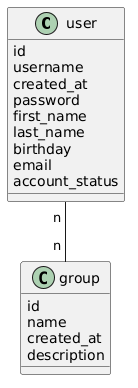
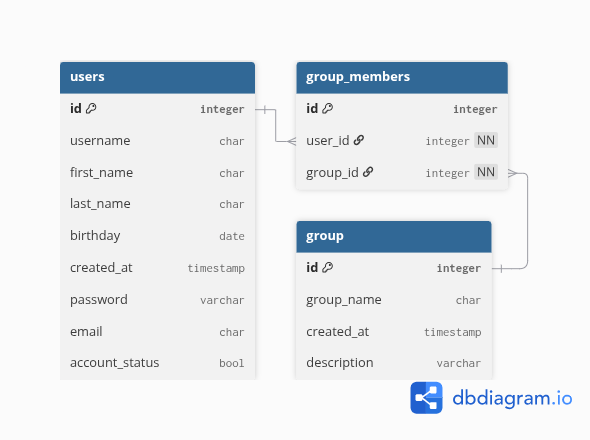

# Login_API_Project
A login REST API for manegement and autentication of users, including the possibility of soft and hard delete. The project also counts with support for groups of users and encrypted passwords.

## Objectives
This project objective is to develop a user authentication and management REST API developed in Go, with full CRUD support (including soft and hard delete), encrypted passwords and a group system with membership verification, using this features:

## Requirements
This system has to be able run this features:

### Functional requirements
• Sign up new users.
• Soft-delete of users (keep in the database).
• Hard-delete of users (delete from database).
• Full update for a user's data.
• Parcial update for a user's data.
• Group creation
• Allow a user to associate with unlimited groups.
• Verification if a user is associated with a specific group.

### No-functional requirements
• Encrypt user's password.
• Swagger documentation of the API
• SonarQube analysis, intending to cover 70% or more of the cases.

## Use cases
• A user can sign up using their first name, last name, birth date and password, to access the system.
• A user can update all of their data by once or just a single field, to keep their account up to date.
• A user can disable their account, keeping it in the data base, so as not to lose their historic.
• A admin can remove permanently a user's account if it's necessary.
• A user can associate with one or more groups, getting access to this groups functionalities.
• The system can verify if a user is in a specific group, to release or restrict an action.

## Domain Model

## Logic Model of the Data Base
